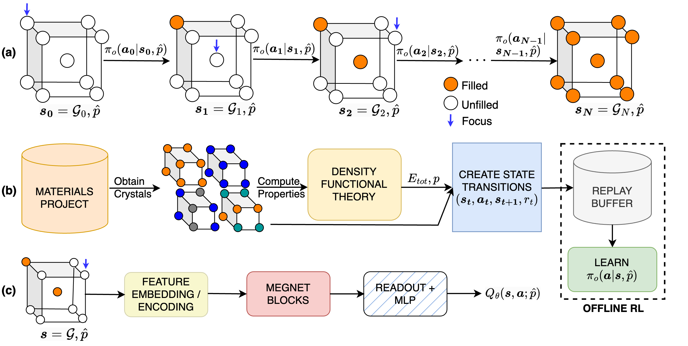

# Offline Reinforcement Learning for Crystal Design

## Introduction

In this work, we adopt conservative Q-learning, a popular offline reinforcement learning approach to learning a conditional policy that can design new and stable crystals having the desired band gap. Our targeted formulation of the reward function for offline RL is crafted from formation energy (per atom) and band gap values computed using first-principles DFT calculations, widely used in computational chemistry. Refer to our [paper](https://openreview.net/forum?id=VbjD8w2ctG) for more details about our methodology.

## Documentation
### Installation
To install, clone the repository  

`git clone https://github.com/chandar-lab/crystal-design.git`

`cd crystal-design`

`pip install -e .`

`cd crystal_design`

### Training 
We use the `crystal_cql.py` in the `runner` folder for training and generation. Use this command for the list of arguments. 

`python crystal_cql.py -h`

To train a conditional CQL model from scratch for 250000 steps, execute

`python crystal_cql.py --data_path <path to trajectory data> --max_timesteps 250000`

To train an unconditional CQL model for 250000 steps, execute

`python crystal_cql.py --data_path <path to trajectory data> --max_timesteps 250000 --nocondition True`

To train a behavioral cloning model for 250000 steps, execute

`python crystal_cql.py --data_path <path to trajectory data> --max_timesteps 250000 --bc True --nocondition True`
